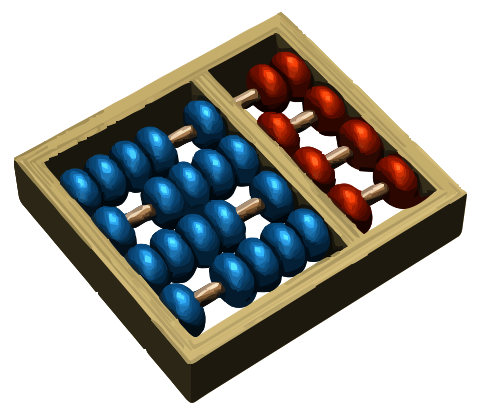

<div align="center">
  
</div>

# COMP™ WebRing

> This WebRing repository is dedicated to the UNICAMP community.
>
> Original credit goes to [ayan20985/skule-webring](https://github.com/ayan20985/skule-webring/tree/main).

The COMP™ WebRing connects websites of UICAMP COMP™ members through a retro-inspired WebRing. It's a way to discover interesting sites, share your work, and build connections.

## Joining the WebRing

### Requirements

1. **Genuine Content** - Your website should be "made with hands," meaning it contains genuine and useful content. Auto-generated sites or pages with minimal effort are not eligible.

2. **Appropriateness** - Content must be appropriate, websites should not host illegal information nor aid in the dissemination of such information.

2. **Website Badge** - You must provide a badge icon in .PNG or .GIF format that will be displayed in the members list. See the [Website Badges](#website-badges) section below for details.

3. **Widget Integration** - The WebRing widget must be included on your website in an accessible location (preferably in the footer or sidebar).

4. **UNICAMP Affiliation** - You must be a member of the Computer Institute at UNICAMP. Special consideration can be granted by sending an email to [webring@skule.ca](mailto:webring@skule.ca).

### Join Process

1. Create a personal website.

2. Add the WebRing widget to your website HTML (template below). 

3. Fork this repository and add your information to the BOTTOM of the `members` array in `js/webring-data.json` following this format:
   ```json
   {
     "name": "Your Name",
     "specialLink": "yourname",
     "websitedisplay": "https://webring.skule.ca/yourname",  // Optional: website URL shown in the directory table
     "website": "https://your-website.com",
     "program": "Your Program (e.g., Engineering, Arts & Science, etc.)",
     "designation": "Your Role (e.g., Undergrad, Grad, Faculty, etc.)",
     "year": "1-25",  // Month and year when added to the WebRing (e.g., 1-25 for January 2025)
     "grad": "2T5",   // Expected graduation year in Engineering format (i.e. 2T5, 2T8) if in engineering, else standard (2025)
     "badge": "https://your-website.com/badge.png"  // URL to your custom website badge
   }
   ```

`websitedisplay` is optional. If set, the directory's Website column will show and link to that value, while `website` remains the canonical personal site used for navigation logic.

4. Submit a Pull Request.

5. Fill in the student information form in [here](https://docs.google.com/forms/d/e/1FAIpQLSdL70J2n1XTJ9DRo2T2uL_Nzn7Jpl_HiuDwihizBAFw6JufzQ/viewform?usp=sharing&ouid=108594782023550487497).

### Personal Shortlinks

Members can be reached using a shortlink under the webring domain `https://webring.skule.ca/yourname`. This should look more official than a vercel.app or github.io link if you should desire to use it.

How shortlinks are resolved:

1. The system uses the `specialLink` field when provided.
2. If `specialLink` is missing, it falls back to a normalized version of `name`.
3. If two members resolve to the same shortlink, ordering in `js/webring-data.json` wins:
- First keeps the base shortlink (example: `name`)
- Second becomes `nameDUPLICATE`
- Third becomes `nameDUPLICATE2`, and so on

Recommended format for `specialLink` values:
- Lowercase letters and numbers
- No spaces
- Keep it short and stable
- Matching is case-insensitive (`nameDUPLICATE` and `nameduplicate` both resolve)

### Maintenance

Websites may be removed from the WebRing if they become defunct (e.g., domain expires, site becomes inaccessible, or content is removed). Websites will be removed if content on websites becomes inappropriate for the ring. We'll make reasonable attempts to contact site owners before removal.

## Widget Templates

Since every website is unique, we suggest you add your own flair to the icon. Here are some examples to get you started:

### Light Mode Widget:
```html
<div style="display: flex; align-items: center; gap: 15px; background-color: #f5f5f5; padding: 15px 25px; border-radius: 8px; border: 1px solid #ddd;">
    <a href="https://WebRing.skule.ca/#https://your-website.com?nav=prev" style="color: #333; text-decoration: none; font-size: 1.5rem;">←</a>
<a href="https://WebRing.skule.ca/#https://your-website.com" target="_blank">

</a>
<a href="https://WebRing.skule.ca/#https://your-website.com?nav=next" style="color: #333; text-decoration: none; font-size: 1.5rem;">→</a>
</div>
<!-- Replace 'your-website.com' with your actual website URL -->
```

### Dark Mode Widget:
```html
<div style="display: flex; align-items: center; gap: 15px; background-color: #2a2a2a; padding: 15px 25px; border-radius: 8px; border: 1px solid #444;">
    <a href="https://WebRing.skule.ca/#https://your-website.com?nav=prev" style="color: #e0e0e0; text-decoration: none; font-size: 1.5rem;">←</a>
<a href="https://WebRing.skule.ca/#https://your-website.com" target="_blank">

</a>
<a href="https://WebRing.skule.ca/#https://your-website.com?nav=next" style="color: #e0e0e0; text-decoration: none; font-size: 1.5rem;">→</a>
</div>
<!-- Replace 'your-website.com' with your actual website URL -->
```

### JSX (Light Mode):
```jsx
<div style={{ 
  display: 'flex', 
  alignItems: 'center', 
  gap: '15px',
  backgroundColor: '#f5f5f5',
  padding: '15px 25px',
  borderRadius: '8px',
  border: '1px solid #ddd'
}}>
    <a href='https://WebRing.skule.ca/#https://your-website.com?nav=prev' style={{ color: '#333', textDecoration: 'none', fontSize: '1.5rem' }}>←</a>
<a href='https://WebRing.skule.ca/#https://your-website.com' target='_blank'>

</a>
<a href='https://WebRing.skule.ca/#https://your-website.com?nav=next' style={{ color: '#333', textDecoration: 'none', fontSize: '1.5rem' }}>→</a>
</div>
// Replace 'your-website.com' with your actual website URL
```

### JSX (Dark Mode):
```jsx
<div style={{ 
  display: 'flex', 
  alignItems: 'center', 
  gap: '15px',
  backgroundColor: '#2a2a2a',
  padding: '15px 25px',
  borderRadius: '8px',
  border: '1px solid #444'
}}>
    <a href='https://WebRing.skule.ca/#https://your-website.com?nav=prev' style={{ color: '#e0e0e0', textDecoration: 'none', fontSize: '1.5rem' }}>←</a>
<a href='https://WebRing.skule.ca/#https://your-website.com' target='_blank'>

</a>
<a href='https://WebRing.skule.ca/#https://your-website.com?nav=next' style={{ color: '#e0e0e0', textDecoration: 'none', fontSize: '1.5rem' }}>→</a>
</div>
// Replace 'your-website.com' with your actual website URL
```

You can also add automatic theme switching based on the user's system preference. Check the GitHub repository for more advanced implementation examples.

## Website Badges

You need to create a custom badge for your website to display in the members table.

### Creating Your Badge

1. Create a PNG, GIF, or SVG image for your website badge
2. Recommended dimensions: 88px × 31px (standard badge size)
3. Upload the badge to your website ~~or include it in a PR~~
4. Include the path to your badge in your member entry in the `badge` field
   - For badges hosted on your website: use the full URL (e.g., `https://your-website.com/badge.png`)
   - ~~For badges included in a PR: use a relative path (e.g., `badges/your-custom-badge.svg`)~~

### Badge Examples and Formatting
Badges must be 88x31 pixels or some multiple of this, they can png, .gif, or .svg file types.
[Here](https://cyber.dabamos.de/88x31/index2.html) are some example badge styles you might consider.

## Credits

Inspired by the [XXIIVV WebRing](https://WebRing.xxiivv.com/) and the early web's interconnected spirit.

This project also credits the original work in [ayan20985/skule-webring](https://github.com/ayan20985/skule-webring/tree/main).

<div align="center">
  
</div>


